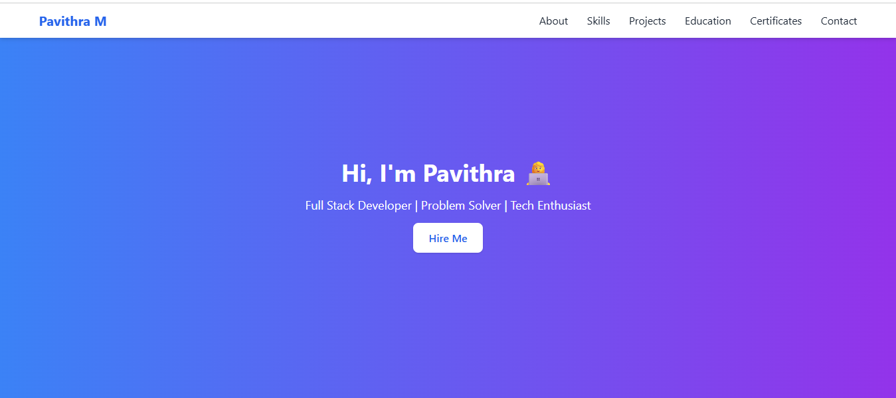

# Pavithra M | Portfolio Website

This is my personal **Portfolio Website** showcasing my skills, projects, and achievements.  
It is built with **HTML, CSS, TailwindCSS, and JavaScript**.

---

## Features
- Responsive design (Mobile, Tablet, Desktop)
- Clean and modern UI with TailwindCSS
- Dedicated sections for **About, Skills, Projects, Contact**
- Easy navigation and user-friendly design

---

## Tech Stack
- **HTML5**
- **CSS3 / TailwindCSS**
- **JavaScript**

---

## Screenshots

---

## Live Demo
[View My Portfolio](https://pavithra6114.github.io/Portfolio/)  

---

## Contact Me
- Email: pavithram@gmail.com  
- LinkedIn: [linkedin.com/in/pavithra](https://www.linkedin.com/in/pavithra-m-88a71a267?utm_source=share&utm_campaign=share_via&utm_content=profile&utm_medium=android_app ) 
- GitHub: [github.com/your-username](https://github.com/Pavithra6114)

---

Thanks for visiting my portfolio repository!  
